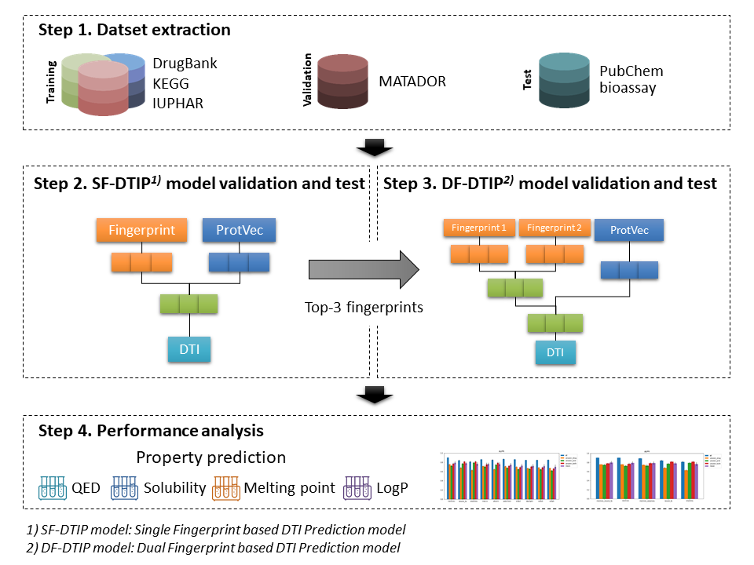

# DeepCombDTI
DeepCombDTI is a model for drug-target interaction prediction using deep learning and various molecular fingerprints.

## Overview

# References
* https://github.com/GIST-CSBL/DeepConv-DTI
