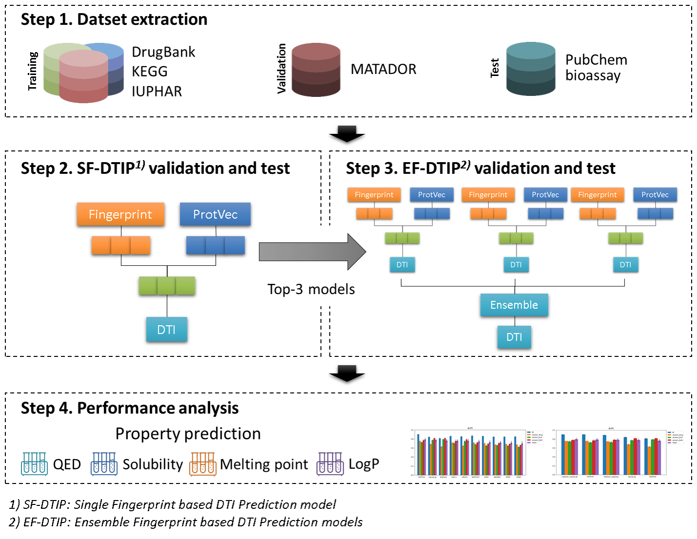
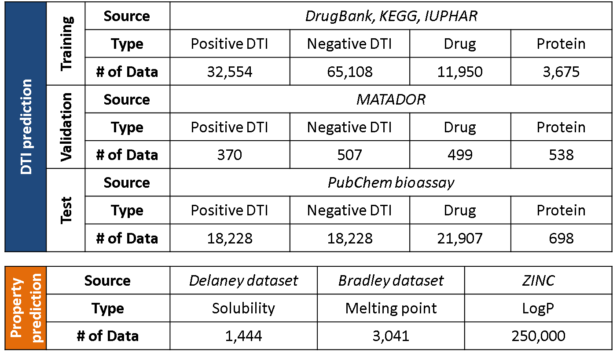
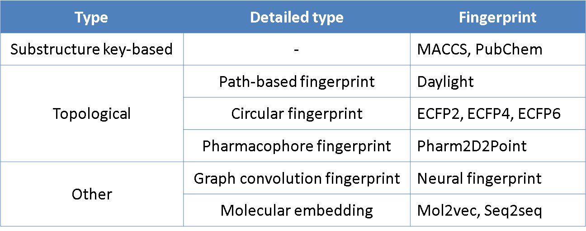

# DeepCombDTI
DeepCombDTI is a model for drug-target interaction prediction using deep learning and various molecular fingerprints.

## Overview



## Dataset



### Molecular fingerprints



## Prediction

```python
import sys, warnings
warnings.filterwarnings('ignore')
```


```python
import DeepCombDTI
from DeepCombDTI.DeepCombDTI import Drug_Target_Prediction
from DeepCombDTI.utils import get_args, get_params, run_validation, run_prediction
```

    Using TensorFlow backend.
    

# Prediction

```python
def predict(dti_num, test_dti):
    # get parameters from arguments
    sys.argv = [
        'DeepCombDTI.py',
        f'data/training/training_dti/{dti_num}.csv',
        'data/training/training_drug.csv',
        'data/training/training_protein.csv',
        '-i', f'data/test/{test_dti}.csv',
        '-d', 'data/test/test_drug.csv',
        '-t', 'data/test/test_protein.csv',
        '-V', 'mol2vec', 'neural_fp', 'seq2seq', '-L', '300', '265', '256', '-c', '150,37', '132,66,33', '128,64,32,16',
        '-v', 'protvec', '-l', '100', '-p', '50,25,12', '50,25', '50,25', '-f', '49,24', '41,20', '41,20',
        '-e', '32', '-y', '0.0001', '-a', 'elu', '-D', '0.0', '-b', '32', '-pt', False,
        '-m', 'model/0/mol_neu_seq_150,37_132,66,33_128,64,32,16_pro_50,25,12_50,25_50,25_fc_49,24_41,20_41,20',
        '--predict', '-n', 'PubChem'
    ]
    args = get_args()
    train_dic, test_dic, train_params, type_params, model_params, output_file = get_params(args)

    # construct DTI prediction model
    dti_prediction_model = Drug_Target_Prediction(**model_params)
#     print(dti_prediction_model.summary())

    # run prediction
    run_prediction(dti_prediction_model, train_params, output_file, train_dic, test_dic)
```


```python
test_dtis = ['test_dti_all', 'test_dti_unseen_drug', 'test_dti_unseen_prot', 'test_dti_unseen_both']
for test_dti in test_dtis:
    predict(0, test_dti)
```

    =====================================================
    Model parameters summary
    =====================================================
    drug_layers_list     : [[150, 37], [132, 66, 33], [128, 64, 32, 16]]
    protein_layers_list  : [[50, 25, 12], [50, 25], [50, 25]]
    fc_layers_list       : [[49, 24], [41, 20], [41, 20]]
    learning_rate        : 0.0001    
    decay                : 0.0001    
    activation           : elu       
    dropout              : 0.0       
    model_output         : model/0/mol_neu_seq_150,37_132,66,33_128,64,32,16_pro_50,25,12_50,25_50,25_fc_49,24_41,20_41,20
    drug_vecs            : ['mol2vec', 'neural_fp', 'seq2seq']
    drug_lens            : [300, 265, 256]
    prot_vec             : protvec   
    prot_len             : 100       
    =====================================================
    Parsing data/test/test_dti_all.csv, data/test/test_drug.csv
    	Positive data : 18228
    	Negative data : 18228
    Prediction
    	Predction of PubChem
    	Area Under ROC Curve(AUC): 0.917
    	Area Under PR Curve(AUPR): 0.926
    =================================================
    Prediction is completed.
    
    =====================================================
    Model parameters summary
    =====================================================
    drug_layers_list     : [[150, 37], [132, 66, 33], [128, 64, 32, 16]]
    protein_layers_list  : [[50, 25, 12], [50, 25], [50, 25]]
    fc_layers_list       : [[49, 24], [41, 20], [41, 20]]
    learning_rate        : 0.0001    
    decay                : 0.0001    
    activation           : elu       
    dropout              : 0.0       
    model_output         : model/0/mol_neu_seq_150,37_132,66,33_128,64,32,16_pro_50,25,12_50,25_50,25_fc_49,24_41,20_41,20
    drug_vecs            : ['mol2vec', 'neural_fp', 'seq2seq']
    drug_lens            : [300, 265, 256]
    prot_vec             : protvec   
    prot_len             : 100       
    =====================================================
    Parsing data/test/test_dti_unseen_drug.csv, data/test/test_drug.csv
    	Positive data : 7740
    	Negative data : 15404
    Prediction
    	Predction of PubChem
    	Area Under ROC Curve(AUC): 0.852
    	Area Under PR Curve(AUPR): 0.784
    =================================================
    Prediction is completed.
    
    =====================================================
    Model parameters summary
    =====================================================
    drug_layers_list     : [[150, 37], [132, 66, 33], [128, 64, 32, 16]]
    protein_layers_list  : [[50, 25, 12], [50, 25], [50, 25]]
    fc_layers_list       : [[49, 24], [41, 20], [41, 20]]
    learning_rate        : 0.0001    
    decay                : 0.0001    
    activation           : elu       
    dropout              : 0.0       
    model_output         : model/0/mol_neu_seq_150,37_132,66,33_128,64,32,16_pro_50,25,12_50,25_50,25_fc_49,24_41,20_41,20
    drug_vecs            : ['mol2vec', 'neural_fp', 'seq2seq']
    drug_lens            : [300, 265, 256]
    prot_vec             : protvec   
    prot_len             : 100       
    =====================================================
    Parsing data/test/test_dti_unseen_prot.csv, data/test/test_drug.csv
    	Positive data : 1464
    	Negative data : 6205
    Prediction
    	Predction of PubChem
    	Area Under ROC Curve(AUC): 0.910
    	Area Under PR Curve(AUPR): 0.794
    =================================================
    Prediction is completed.
    
    =====================================================
    Model parameters summary
    =====================================================
    drug_layers_list     : [[150, 37], [132, 66, 33], [128, 64, 32, 16]]
    protein_layers_list  : [[50, 25, 12], [50, 25], [50, 25]]
    fc_layers_list       : [[49, 24], [41, 20], [41, 20]]
    learning_rate        : 0.0001    
    decay                : 0.0001    
    activation           : elu       
    dropout              : 0.0       
    model_output         : model/0/mol_neu_seq_150,37_132,66,33_128,64,32,16_pro_50,25,12_50,25_50,25_fc_49,24_41,20_41,20
    drug_vecs            : ['mol2vec', 'neural_fp', 'seq2seq']
    drug_lens            : [300, 265, 256]
    prot_vec             : protvec   
    prot_len             : 100       
    =====================================================
    Parsing data/test/test_dti_unseen_both.csv, data/test/test_drug.csv
    	Positive data : 1464
    	Negative data : 4980
    Prediction
    	Predction of PubChem
    	Area Under ROC Curve(AUC): 0.914
    	Area Under PR Curve(AUPR): 0.826
    =================================================
    Prediction is completed.
    

## References
* https://github.com/GIST-CSBL/DeepConv-DTI
